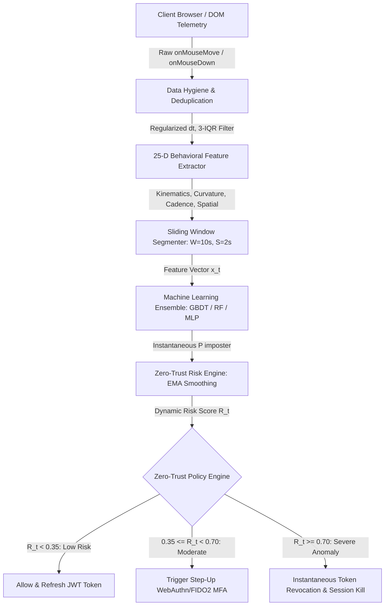
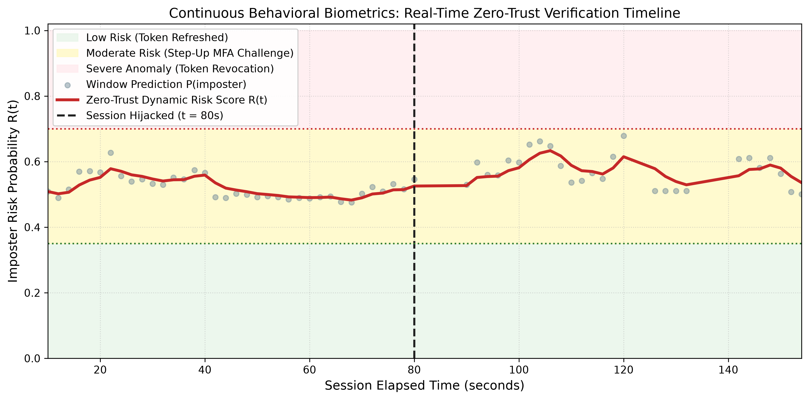

# Behavioral Biometrics for Zero-Trust Web Architectures: Continuous Authentication via Cursor Dynamics

[](https://www.python.org/downloads/)
[](https://opensource.org/licenses/MIT)
[-green.svg)](https://csrc.nist.gov/publications/detail/sp/800-207/final)
[](https://github.com/balabit/Mouse-Dynamics-Challenge)
[]()
[](https://github.com/psf/black)

---

## 📌 Executive Summary

Traditional web security architectures rely almost exclusively on perimeter **Point-of-Entry (PoE)** mechanisms (such as static passwords and multi-factor authentication). Once initial authentication succeeds, systems issue stateless session tokens (e.g., JSON Web Tokens) that implicitly trust the client until explicit expiration. This creates a critical enterprise vulnerability known as the **post-login exposure gap**, enabling:
- **Physical session hijacking** (unlocked unattended workstations in corporate environments).
- **Malware-driven token exfiltration** and cookie replay attacks.
- **Insider threats** and credential sharing.

In accordance with **Zero-Trust Architecture (ZTA)** codified by **NIST SP 800-207** (*"Never trust, always verify"*), this research establishes an end-to-end continuous, passive authentication framework using **neuromotor mouse cursor dynamics**. By analyzing DOM-level micro-movements, angular velocity, click cadences, and cognitive pauses, the system computes a real-time risk score $R(t)$ that automatically triggers adaptive step-up authentication or instantaneous cryptographic token revocation upon biometric divergence.

---

## 🏗️ System Architecture



---

## 🔬 25-Dimensional Behavioral Feature Pipeline

The framework extracts 25 kinematic, angular, interaction cadence, and spatial descriptors designed to characterize individual motor control signatures:

| Category | Feature Name | Mathematical Formulation | Neuromotor Significance |
| :--- | :--- | :--- | :--- |
| **Kinematics** | `avg_velocity` ($\mu_v$) | $\frac{1}{N} \sum \frac{\Delta d_i}{\Delta t_i}$ | Habitual arm/wrist baseline movement speed |
| | `std_velocity` ($\sigma_v$) | $\sqrt{\frac{1}{N} \sum (v_i - \mu_v)^2}$ | Motor control consistency and ballistic variance |
| | `max_velocity` ($v_{\max}$) | $\text{percentile}(v, 99)$ | Peak acceleration capability during fast sweeps |
| | `median_velocity` ($\tilde{v}$) | $\text{median}(v_i)$ | Typical operational navigation speed |
| | `avg_acceleration` ($\mu_{|a|}$) | $\frac{1}{N} \sum \left\| \frac{\Delta v_i}{\Delta t_i} \right\|$ | Fine-grained muscle deceleration targeting |
| | `std_acceleration` ($\sigma_a$) | $\sqrt{\frac{1}{N} \sum (|a_i| - \mu_a)^2}$ | Smoothness of ballistic targeting adjustments |
| **Angular Dynamics** | `avg_angular_velocity` ($\mu_\omega$) | $\frac{1}{N} \sum \frac{\|\Delta \theta_i\|}{\Delta t_i}$ | Directional steering velocity across curved arcs |
| | `avg_curvature` ($\mu_\kappa$) | $\frac{1}{N} \sum \frac{\|\Delta \theta_i\|}{\Delta d_i + \epsilon}$ | Path tortuosity and motor trajectory curvature |
| **Interaction Cadence** | `click_count` | $\sum \mathbb{I}(\text{state} \in \{\text{Pressed}, \text{Down}\})$ | Event frequency on interactive GUI elements |
| | `click_rate` ($f_{\text{click}}$) | $\frac{N_{\text{clicks}}}{T_{\text{duration}}}$ | Operational cadence and task engagement rhythm |
| | `drag_count` | $\sum \mathbb{I}(\text{state} = \text{Drag})$ | Text selection and drag-and-drop frequency |
| | `drag_ratio` | $\frac{N_{\text{drag}}}{N_{\text{events}}}$ | Proportion of time manipulating GUI elements |
| | `pause_count` | $\sum \mathbb{I}(\Delta t_i > 0.5\text{s} \land \Delta d_i < 5\text{px})$ | Visual scanning hesitation instances |
| | `pause_ratio` ($\rho_{\text{pause}}$) | $\frac{N_{\text{pause}}}{N_{\text{events}}}$ | Ratio of cognitive pause to active navigation |
| **Spatial Geometry** | `total_distance` | $\sum_{i=2}^N \Delta d_i$ | Cumulative physical distance traveled |
| | `straightness` ($\eta$) | $\min\left(50.0, \frac{\sum \Delta d_i}{\Delta d_{\text{Euclidean}} + \epsilon}\right)$ | Trajectory directness vs. exploratory wandering |
| | `x_mean`, `y_mean` | $\frac{1}{N}\sum x_i, \frac{1}{N}\sum y_i$ | Centroid of screen workspace activity |
| | `x_std`, `y_std` | $\sigma_x, \sigma_y$ | Spatial dispersion across display monitors |
| | `x_range`, `y_range` | $\max(x) - \min(x), \max(y) - \min(y)$ | Viewport coverage boundaries |
| | `avg_sampling_rate` | $\frac{N_{\text{events}}}{T_{\text{duration}}}$ | Hardware polling frequency and event density |
| **Temporal Metadata** | `num_events`, `duration` | $N, t_N - t_1$ | Session volume and active elapsed duration |

---

## 📊 Benchmark Experimental Results

Evaluated on the benchmark **Balabit Mouse Dynamics Challenge** across 10 user cohorts (565 sessions; 324 legitimate, 241 imposter) using 5-Fold Stratified Cross-Validation:

| Model Architecture | ROC-AUC | Equal Error Rate (EER) | Accuracy (%) | F1-Score | Inference Latency |
| :--- | :---: | :---: | :---: | :---: | :---: |
| **Gradient Boosting (GBDT)** | **0.8603** | **22.41%** | **79.65%** | **0.7569** | 8.08 s |
| **Random Forest** | **0.8536** | **23.15%** | **77.70%** | **0.7364** | 5.31 s |
| **Extra Trees** | **0.8504** | **22.82%** | **77.70%** | **0.7407** | 3.79 s |
| **Logistic Regression** | 0.8216 | 25.31% | 75.58% | 0.7184 | **0.19 s** |
| **Multi-Layer Perceptron (MLP)** | 0.8202 | 24.90% | 74.16% | 0.7008 | 1.49 s |
| **Support Vector Machine (RBF)** | 0.8159 | 24.07% | 76.28% | 0.7137 | 0.67 s |
| **k-Nearest Neighbors (k-NN)** | 0.7872 | 27.78% | 72.74% | 0.6831 | 2.79 s |
| **One-Class SVM (Unsupervised)** | 0.5593 | 47.53% | 60.35% | 0.4197 | 0.10 s |
| **Isolation Forest (Unsupervised)** | 0.4839 | 52.47% | 54.34% | 0.4000 | 3.54 s |

> **Key Takeaway:** Supervised non-linear tree ensembles (Gradient Boosting and Random Forest) achieve the highest discrimination capability ($\text{ROC-AUC} \ge 0.853$, $\text{EER} \approx 22.4\%$), confirming that human cursor motor patterns encode strong biometric entropy capable of continuous insider threat detection.

---

## 🛡️ Zero-Trust Continuous Verification Simulation

The framework provides an interactive session hijacking simulator. As a user navigates a web application, telemetry is segmented into sliding frames ($W = 10\text{ s}, S = 2\text{ s}$). The risk engine computes an Exponential Moving Average (EMA) score:

$$R(t) = \alpha \cdot P(\text{imposter})_t + (1 - \alpha) \cdot R(t-1)$$

### Policy Action Thresholds
- **$R(t) < 0.35$ (Low Risk):** Active user verified passively; JWT token refreshed transparently.
- **$0.35 \le R(t) < 0.70$ (Moderate Risk):** Minor motor variance; triggers a non-disruptive Step-Up WebAuthn / FIDO2 challenge.
- **$R(t) \ge 0.70$ (Severe Anomaly):** Severe biometric divergence; token is **instantaneously revoked**, blacklisted in memory, and the active session is terminated.



---

## 🚀 Quickstart & Installation

### 1. Clone the Repository
```bash
git clone https://github.com/nityanand-kg/mouse-dynamics-zero-trust.git
cd mouse-dynamics-zero-trust
```

### 2. Set Up Virtual Environment & Dependencies
```bash
python -m venv .venv
# On Windows PowerShell:
.\.venv\Scripts\Activate.ps1
# On Linux/macOS:
source .venv/bin/activate

pip install -r requirements.txt
```

---

## 💻 Usage Guide & CLI

The framework exposes a unified Command-Line Interface (`src/cli.py`):

### Run Full Model Benchmark
Trains all 9 classification pipelines, computes ROC-AUC, EER, accuracy, and exports LaTeX/CSV tables:
```bash
python -m src.cli --mode benchmark
```

### Run Live Session Hijacking Simulation
Simulates a live workstation session where account `user7` is hijacked at $t = 80\text{ s}$:
```bash
python -m src.cli --mode simulate --user user7
```

### Run Feature Group Ablation Study
Quantifies the individual predictive power of kinematics, angular curvature, cadence, and spatial dimensions:
```bash
python -m src.cli --mode ablation
```

### Run Unit Test Suite
Executes the comprehensive automated unit test suite across feature extractors, models, and Zero-Trust managers:
```bash
python -m src.cli --mode test
```

### Interactive Jupyter Notebook Walkthrough
Launch the interactive notebook demonstrating data inspection, feature distributions, model training, and continuous simulation:
```bash
jupyter notebook notebooks/01_zero_trust_walkthrough.ipynb
```

---

## 📁 Repository Structure

```
mouse-dynamics-zero-trust/
├── README.md                          # Comprehensive project documentation
├── LICENSE                            # MIT Open Source License
├── requirements.txt                   # Production & research dependencies
├── pyproject.toml                     # Modern Python packaging specification
├── .gitignore                         # Exclusions for raw datasets, caches, LaTeX build files
├── data/
│   └── engineered_features.csv        # Pre-extracted 25-feature matrix (reproducible baseline)
├── src/
│   ├── __init__.py
│   ├── config.py                      # Global paths, thresholds, and canonical feature definitions
│   ├── cli.py                         # Unified CLI entry point
│   ├── data/
│   │   ├── loader.py                  # Raw Balabit session loader and stream generator
│   │   └── preprocessor.py            # Telemetry deduplication, dt regularizer, 3-IQR filter
│   ├── features/
│   │   ├── extractor.py               # 25-dimensional behavioral biometric feature engine
│   │   └── windowing.py               # Sliding window segmenter (W=10s, S=2s)
│   ├── models/
│   │   ├── baselines.py               # Random Forest, SVM (RBF), GBDT, k-NN, Logistic Regression
│   │   ├── mlp.py                     # Multi-Layer Perceptron (sklearn & NumPy scratch implementation)
│   │   └── anomaly_detector.py        # One-Class SVM & Isolation Forest for unsupervised enrollment
│   ├── evaluation/
│   │   ├── metrics.py                 # EER calculator, ROC-AUC, FAR, FRR, F1-score
│   │   └── plots.py                   # High-res publication plots (ROC, DET, feature importances)
│   └── zero_trust/
│       ├── risk_engine.py             # Dynamic EMA risk scorer and policy state engine
│       └── token_manager.py           # Simulated JWT token lifecycle and revocation blacklist
├── experiments/
│   ├── run_benchmark.py               # Full benchmark runner producing CSV/LaTeX tables
│   ├── run_continuous_simulation.py   # Live session hijacking simulation
│   └── ablation_study.py              # Feature subset ablation experiment
├── notebooks/
│   └── 01_zero_trust_walkthrough.ipynb # Interactive tutorial and visualization walkthrough
├── tests/
│   ├── test_features.py               # Unit tests for feature extraction and windowing
│   ├── test_models.py                 # Unit tests for model pipelines and metric calculations
│   └── test_zero_trust.py             # Unit tests for risk engine and token revocation state machine
└── outputs/
    ├── figures/                       # High-resolution publication plots (PNG)
    │   ├── roc_curves_comparison.png
    │   ├── det_curves_comparison.png
    │   ├── feature_importances.png
    │   └── session_hijacking_timeline.png
    └── tables/                        # Generated benchmark tables
        ├── benchmark_results.csv
        ├── benchmark_results.tex
        └── ablation_study_results.csv
```

---

## 📑 Citation

If you utilize this research framework, codebase, or methodology in your work, please cite:

```bibtex
@article{nityanand2026behavioral,
  author    = {Nityanand, K. G.},
  title     = {Behavioral Biometrics for Zero-Trust Web Architectures: Continuous Authentication via Cursor Dynamics},
  journal   = {Department of Computer Science and Engineering, CHRIST (Deemed to be University)},
  year      = {2026},
  url       = {https://github.com/nityanand-kg/mouse-dynamics-zero-trust}
}

@inproceedings{balabit2016dataset,
  author    = {F{\"u}l{\"o}p, {\'A}kos and Kov{\'a}cs, Levente and Kurics, Tam{\'a}s and Windhager-Pokol, Eszter},
  title     = {Balabit Mouse Dynamics Challenge Data Set},
  booktitle = {DataPallet Challenge},
  year      = {2016},
  url       = {https://github.com/balabit/Mouse-Dynamics-Challenge}
}
```

---

## 📜 License

This project is licensed under the **MIT License** - see the [LICENSE](LICENSE) file for details.
